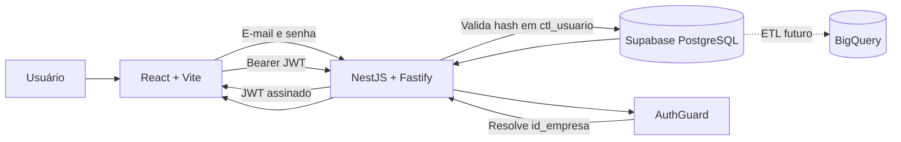

# Glazia

<div align="center">
  <strong>Gestão financeira inteligente para vidraçarias e empresas de esquadrias.</strong>
  <br />
  <br />
  
  
  
  
</div>

---

## Sobre o projeto

O **Glazia** é uma plataforma SaaS de controle financeiro criada para atender as particularidades de vidraçarias e empresas de esquadrias. A aplicação centraliza lançamentos, custos, despesas recorrentes e indicadores de negócio em uma experiência moderna, responsiva e preparada para múltiplas empresas.

O princípio central da arquitetura é simples:

> Uma empresa nunca pode visualizar, alterar ou inferir dados de outra empresa.

Por isso, o isolamento multi-tenant não depende apenas da interface. Ele é aplicado na API, nas consultas ao banco, nas políticas de Row Level Security e nas validações de integridade do PostgreSQL.

## Funcionalidades

### Disponíveis

- Autenticação própria da API, com hash scrypt e JWT assinado pelo servidor.
- Dashboard financeiro responsivo com modo claro e escuro.
- Indicadores, gráficos e análises de fluxo de caixa.
- Catálogo de produtos e insumos com seleção em cascata (linha → produto → cor).
- Lançamento de vendas com itens e gastos atrelados, em transação única.
- Custos fixos com vigência determinada ou indeterminada e geração de previsões.
- Configuração de conta: troca de senha e de e-mail de acesso.
- Tour guiado contextual em todas as telas.
- Migration-base versionada com PK, FK, UNIQUE e CHECK aplicados pelo banco.
- Resolução segura da empresa a partir do usuário autenticado.
- Filtros explícitos por `id_empresa` em todas as consultas de negócio.
- RLS habilitada em modo deny-all para os papéis da Data API.
- Validação de ambiente, DTOs e payloads da API.
- Testes unitários e E2E básicos.

### Em desenvolvimento

- E2E com Fastify, JWT e isolamento entre dois tenants.
- Otimização do carregamento e dos chunks do frontend.
- Pipeline analítico entre PostgreSQL e BigQuery.
- Camada de inteligência financeira baseada em dados reais.

## Arquitetura



### Fluxo de segurança

1. O frontend envia e-mail e senha para `POST /auth/login`.
2. A API confere a senha contra o hash scrypt em `analytics.ctl_usuario`.
3. A API devolve um JWT que ela mesma assina com `JWT_SECRET`.
4. O `AuthGuard` valida o token e monta o contexto autenticado.
5. O `id_empresa` é obtido no servidor e nunca aceito do navegador.
6. A API aplica o filtro de tenant explicitamente em toda consulta.
7. Constraints de PK, FK e CHECK barram dados inconsistentes no banco.
8. A RLS está ativa sem policies, bloqueando a Data API pública; só a
   conexão direta da API, feita como owner, enxerga os schemas.

## Tecnologias

### Frontend

- React 19
- TypeScript
- Vite
- React Router
- Recharts
- Framer Motion
- Lucide React
- Supabase JS

### Backend

- NestJS 11
- Fastify
- TypeScript
- Class Validator
- Zod
- Helmet
- Jest e Supertest

### Dados e segurança

- Supabase Auth
- PostgreSQL
- Row Level Security
- JWT
- Triggers de integridade multi-tenant
- BigQuery planejado para cargas analíticas

## Estrutura do repositório

```text
Glazia/
├── src/
│   ├── components/       # Componentes visuais compartilhados
│   ├── context/          # Sessão e estado da aplicação
│   ├── pages/            # Login, análises, lançamentos e despesas
│   ├── services/         # Cliente HTTP da API
│   ├── tour/             # Fluxos do tour guiado
│   ├── types/            # Tipos do domínio
│   └── utils/            # Formatação e cálculos financeiros
├── server/
│   ├── src/
│   │   ├── analytics/      # Consultas do painel de sócios
│   │   ├── auth/           # Login, guard JWT e conta do usuário
│   │   ├── catalogo/       # Produtos e insumos em cascata
│   │   ├── database/       # Pool Postgres e transações
│   │   ├── despesas-fixas/ # CRUD de custos fixos
│   │   └── lancamentos/    # Vendas e custos operacionais
│   └── test/             # Testes E2E
├── supabase/
│   └── migrations/       # Schema-base, catálogo, views e lockdown
├── docs/                 # Documentação de arquitetura
└── public/               # Recursos públicos do frontend
```

## Como executar localmente

### Pré-requisitos

- Node.js 20.19 ou superior.
- npm.
- Um projeto Supabase de desenvolvimento.
- Git.

### 1. Clone o repositório

```bash
git clone https://github.com/toquemclarim/glazia.git
cd glazia
```

### 2. Instale as dependências

```bash
npm install
npm --prefix server install
```

### 3. Configure o frontend

Copie `.env.example` para `.env.local` e preencha somente com os dados públicos do seu projeto:

```env
VITE_SUPABASE_URL=https://seu-projeto.supabase.co
VITE_SUPABASE_PUBLISHABLE_KEY=sua-chave-publicavel
VITE_API_URL=http://localhost:3000/api/v1
```

### 4. Configure a API

Copie `server/.env.example` para `server/.env`:

```env
NODE_ENV=development
PORT=3000
CORS_ORIGIN=http://localhost:5173
DATABASE_URL=postgresql://postgres.<ref>:<senha>@<host-do-pooler>:5432/postgres
DB_SCHEMA=analytics
DB_CATALOG_SCHEMA=dt_catalogo
JWT_SECRET=uma-chave-longa-e-aleatoria
```

> A `DATABASE_URL` contém a senha do banco. Ela fica apenas em `server/.env`,
> que é ignorado pelo Git, e nunca no frontend, em logs ou no repositório.

### 5. Inicie frontend e API

```bash
npm run dev:full
```

A aplicação ficará disponível nos seguintes endereços:

- Frontend: `http://localhost:5173`
- API: `http://localhost:3000/api/v1`
- Health check: `http://localhost:3000/api/v1/health`

### Estado das migrations

`supabase/migrations` contém a migration-base completa e reproduzível. Aplicadas em ordem, elas criam do zero os schemas `analytics` e `dt_catalogo`, populam o catálogo, criam as views analíticas e fecham o acesso público:

| Ordem | Migration | O que faz |
| --- | --- | --- |
| 0001 | `glazia_base_schema` | Dimensões, fatos, PK, FK, UNIQUE, CHECK e índices |
| 0002 | `glazia_catalogo` | `ctl_produtos` e `ctl_custos` |
| 0003 | `glazia_catalogo_seed` | 88 produtos e 50 insumos de mercado |
| 0004 | `glazia_views` | `vw_venda_itens`, `vw_perdas_retrabalhos` e demais |
| 0005 | `glazia_lockdown` | RLS deny-all e revogação para `anon`/`authenticated` |

## Scripts

### Projeto completo

```bash
npm run dev:full      # Frontend e API em modo desenvolvimento
npm run build:all     # Build do frontend e da API
npm run lint          # Análise estática do frontend
npm run docs:pdf      # Gera a documentação de arquitetura
```

### API

```bash
npm --prefix server run start:dev
npm --prefix server run build
npm --prefix server run test
npm --prefix server run test:e2e
npm --prefix server run test:cov
```

## Endpoints atuais

- `GET /api/v1/health` — estado da API; rota pública.
- `GET /api/v1/me` — usuário e empresa autenticados.
- `POST /api/v1/auth/login` — autenticação; rota pública.
- `GET /api/v1/conta/perfil` — dados da conta do usuário.
- `PATCH /api/v1/conta/senha` — troca de senha.
- `PATCH /api/v1/conta/email` — troca do e-mail de acesso.
- `GET /api/v1/catalogo/linhas` — linhas comerciais ativas.
- `GET /api/v1/catalogo/produtos` — cascata de produtos e cores.
- `GET /api/v1/catalogo/tipos-custo` — tipos de insumo.
- `GET /api/v1/catalogo/custos` — insumos para o CRUD de custos.
- `GET /api/v1/lancamentos/vendas` — vendas da empresa.
- `POST /api/v1/lancamentos/vendas` — venda com itens e gastos.
- `POST /api/v1/lancamentos/custos` — custo operacional.
- `GET /api/v1/despesas-fixas` — custos fixos ativos e total mensal.
- `POST /api/v1/despesas-fixas` — novo custo fixo.
- `PATCH /api/v1/despesas-fixas/:id` — edição do custo fixo.
- `DELETE /api/v1/despesas-fixas/:id` — inativação do custo fixo.
- `GET /api/v1/analytics/painel-socios` — painel consolidado do mês.
- `GET /api/v1/analytics/{resultado,rentabilidade,quantidade-produto,custos-fixos,contas-a-vencer,projecao-metas}` — indicadores individuais.

Com exceção do health check, todas as rotas exigem:

```http
Authorization: Bearer <jwt>
```

## Testes e qualidade

O backend possui testes para:

- Saúde da aplicação.
- Validação do guard de autenticação.
- Injeção segura do `id_empresa`.
- Rejeição do tenant enviado pelo cliente.

Execute a suíte completa da API:

```bash
npm --prefix server run test
npm --prefix server run test:e2e
```

## Documentação

O guia técnico detalha autenticação, multi-tenancy, RLS, modelo operacional e a evolução planejada para BigQuery:

- [Glazia — Arquitetura: guia técnico para quem está começando](docs/Glazia-Arquitetura-Guia-Junior.pdf)

## Boas práticas de segurança

- Nunca aceite `id_empresa` enviado pelo cliente.
- Nunca exponha a `DATABASE_URL` nem a `service_role`.
- A API é o único caminho até o banco; a Data API pública fica bloqueada.
- Aplique filtros explícitos de tenant em toda consulta de negócio.
- Teste toda funcionalidade com pelo menos duas empresas.
- Não registre tokens, senhas ou dados financeiros sensíveis.
- Versione toda mudança de schema por migrations revisáveis.

## Roadmap

- [x] Consolidar a migration-base e reconciliar o histórico do banco.
- [x] Integrar despesas fixas ao Supabase.
- [x] Persistir materiais em campo estruturado.
- [ ] Restringir alterações de cargo nos perfis.
- [ ] Criar E2E real com Fastify e dois tenants.
- [ ] Adicionar observabilidade e tratamento central de erros.
- [ ] Implementar outbox, ETL e BigQuery.
- [ ] Conectar a inteligência financeira aos dados reais.

## Autor

Desenvolvido por **Lucas Matos**.

- [LinkedIn](https://linkedin.com/in/lucasmatospy)
- [GitHub](https://github.com/toquemclarim)
- [E-mail](mailto:iamlucasmatos@gmail.com)

---

<div align="center">
  <strong>Glazia</strong> — clareza financeira para quem transforma vidro e alumínio em grandes projetos.
</div>
